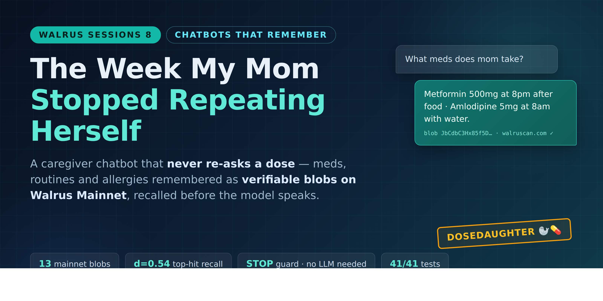

# DoseDaughter 🐘

**A caregiver chatbot that never re-asks a dose.** It remembers your mother's medications, allergies, and routines across conversations — permanently, on Walrus — and blocks unsafe answers before they happen.

Built for **Walrus Session 8: Chatbots That Remember** (Sept 18 – Oct 9, 2026).



## The problem

Family caregivers manage a parent's medications from memory and scattered notes. Every new chatbot session starts from zero: *"What medications is she on? Any allergies?"* — asked again and again. For a person juggling Metformin schedules and a parent who can't remember what they told the doctor last week, that amnesia isn't an inconvenience; it's a safety hazard.

## The fix: memory that does the work

DoseDaughter stores every fact the family teaches it as an **encrypted blob on Walrus Mainnet** via [Walrus Memory](https://www.walrus.xyz) — then recalls it at the right moment:

- **Teach once, remember forever.** *"Mom takes Metformin 500mg at 8pm after food"* → stored as a Walrus blob, recalled in every future session.
- **Deterministic allergy STOP.** Ask *"Can she take ibuprofen for her headache?"* and a coded guard fires **before the LLM even runs**, citing the exact blob that recorded the allergy. Safety doesn't depend on the model behaving.
- **Doctor-visit summary from recall only.** `GET /api/summary` compiles medications, allergies, routine, and care contacts — no hallucination, every line traceable to a blob.
- **Public receipts.** A `/memory` page shows every stored fact with a live [walruscan.com](https://walruscan.com) link. Nothing to hide, everything to verify.

**All memory lives on Walrus Mainnet** — 13 verified blobs for the demo persona, every one linkable. No Postgres, no vector DB, no server-side state.

## Quickstart (2 minutes, no keys)

```bash
git clone https://github.com/tejas0111/dosedaughter.git
cd dosedaughter/app
npm install
cp .env.example .env        # defaults work for the local demo
npm test                    # 41 offline self-tests, no network
npm run dev                 # server on :3001
```

Try it:

```bash
# Teach a fact
curl -X POST localhost:3001/api/chat \
  -H 'Content-Type: application/json' \
  -d '{"userId":"demo-mom","message":"I take Metformin 500mg at 8pm after food"}'

# Ask — it recalls from memory
curl -X POST localhost:3001/api/chat \
  -H 'Content-Type: application/json' \
  -d '{"userId":"demo-mom","message":"What meds does mom take?"}'

# Doctor-visit summary, compiled from recall only
curl 'localhost:3001/api/summary?user=demo-mom'

# See every stored fact + Walrus blob links
open 'localhost:3001/memory?user=demo-mom'

# Live before/after demo: empty memory (day 1) vs taught memory (day 7)
open 'localhost:3001/demo?persona=day7'
```

Without an LLM key the bot still works (echo replies that prove the memory flow). Add `OPENROUTER_API_KEY` to `.env` for real Gemini-powered replies. See `app/README.md` for the full endpoint table, Telegram setup, and troubleshooting.

## How it works

```
User (web / Telegram)
        │
        ▼
Express server ── recall top-5 (distance < 0.7) ──► inject into system prompt
        │                                                    │
        │                                         coded allergy guard (STOP)
        │                                                    │
        ▼                                                    ▼
write gate (shouldRemember) ──► Walrus Memory ──► Walrus Mainnet blob
(never saves questions)          Seal-encrypted      (receipt on /memory)
```

- **Recall before generation** — relevant memories are fetched and injected *before* the LLM sees the message.
- **Write gate after** — a `shouldRemember()` classifier decides what's worth storing; questions and chit-chat are never saved.
- **Deterministic safety** — allergy conflicts block the reply before the LLM runs, citing the blob ID.
- **Per-user namespaces** — `user-<id>` isolates every family member's memory.

Full architecture, design decisions, and the fact schema: [docs/](docs/).

## Repository layout

```
app/                  Express server, Telegram bot, MemWal wrapper, seeder, 41 self-tests
docs/images/          Architecture + demo visuals (sources included)
evidence/             Append-only proof: blob ledger, test log, transcripts, load probe
```

## Evidence

Everything claimed here is verifiable:

| Claim | Proof |
|---|---|
| 13 blobs live on Walrus Mainnet | [evidence/blob-ledger.md](evidence/blob-ledger.md) — every ID with walruscan link |
| Recall + STOP guard + summary E2E | [evidence/TEST-LOG.md](evidence/TEST-LOG.md) — 39 dated probes |
| Full teach→recall→reply transcripts | [evidence/DEMO-TRANSCRIPT.md](evidence/DEMO-TRANSCRIPT.md) |
| 50/50 requests, p95 12ms, 0 errors | [evidence/LOAD-PROBE.md](evidence/LOAD-PROBE.md) |
| 41/41 offline self-tests pass | `npm test` — run it yourself |

Demo namespace on mainnet: `user-demo-mom` · Agent ID: `0x8c66ca90cc9b282f028df78dee53a89416db780dae0bc9879f605324bdbbb783`

## Stack

- **Node.js ≥ 20** + Express
- [`@mysten-incubation/memwal`](https://www.npmjs.com/package/@mysten-incubation/memwal) — Walrus Memory SDK (Seal-encrypted blobs on Walrus Mainnet)
- **Gemini 2.5 Flash** via OpenRouter (swappable — proven working with 3 free non-OpenAI/Anthropic models)
- Optional Telegram channel (`node-telegram-bot-api`)
- Vercel-ready (`api/index.js` + `DEPLOY.md`)

## Medical disclaimer

DoseDaughter reminds and flags only — it never adjusts dosages and is not medical advice. Always confirm with your doctor.

## License

[MIT](LICENSE)
